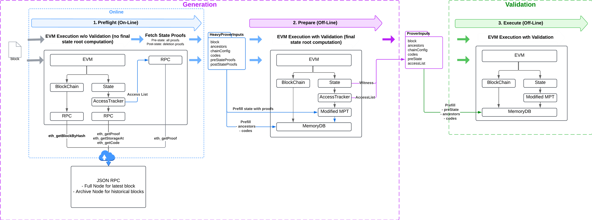

# Prover Inputs Generation

This section describe the process for generating Prover Inputs the minimal necessary data for ZK EVM prover engines to prove a block. It consists of 3 steps: [1. Prefligth](#step-1-preflight), [2. Prepare](#step-2-prepare) and [3. Execute](#step-3-execute)

## About Ethereum

On an EVM-compatible chain, any block `B` induces a state transition from `S` to `S'`, where `S` is the pre-state of the parent block and `S'` is the final state after executing the block using the EVM.

In an EVM chain, block transitions are deterministic. Given that every node in the network executes the same blocks starting from the same initial state, every node ends up with the same state at any given block. This forms a decentralized state machine.

### Ethereum State

The EVM state is composed of:

- **Account State (World State):** Contains account data, stored as a Merkle Patricia Trie (MPT), where:
  - **Keys** are the Keccak hash of account addresses.
  - **Values** are the RLP encoding of account data:
    - Balance of the account.
    - Nonce of the account.
    - Code hash of the account (for smart contracts).
    - Storage root of the MPT storage of the account (for smart contracts).
- **Storage for Each Account:** Stored as an MPT, where:
  - **Keys** are the Keccak hash of slot indices.
  - **Values** are the slot values.

The Ethereum state root is the Merkle Patricia root of the account state trie.

### EVM Block Execution

The execution of an EVM block involves operations such as processing transactions, handling system calls, accounting for block rewards... which results in a set of elementary state transitions that can be categorized as follows:

| **State Transition**            | **Description**                                                                                                    | **Example of Operation**                                                                                      |
|---------------------------|--------------------------------------------------------------------------------------------------------------------|--------------------------------------------------------------------------------------------------|
| **Create an account**     | Create a new account object in the account state trie.                                                             | Deploying a new smart contract.                                                                 |
| **Update an account**     | Update one or more account fields: balance, nonce, or storage hash (note: `codeHash` cannot be changed).           | Updating balance when transferring ETH, updating nonce when executing a transaction, etc.       |
| **SelfDestruct an account** | Delete an account.                                                                                                | Self-destructing a smart contract.                                                              |
| **Create a storage**      | Set an empty storage slot to a non-null value.                                                                     | Any call to `SSTORE(slot, value)` on an empty slot with `value ≠ 0`.                        |
| **Update a storage**      | Set a non-empty storage slot to a non-null value.                                                                  | Any call to `SSTORE(slot, value)` on a non-empty slot with `value ≠ 0`.                     |
| **Delete a storage**      | Set a non-empty storage slot to zero.                                                                              | Any call to `SSTORE(slot, 0)` on a non-empty slot.                                              |

Starting from parent state `S`, applying all state transitions induced by the execution of block `B` results in the final state `S'`.

Practically, the final state root `S'` is first computed by the block proposer and included in the block header at block proposal time. When other nodes receive the proposed block, they re-execute the block on their local state, validate the computed final state root against the one in the block header, and reject the block in case of a mismatch.

### Block witness

Block witness encompasses the minimal state and chain data required for a stateless EVM block execution (meaning without access to a a database containing the full state) which includes
- performing all block operations (apply transactions, apply fee rewards, apply system calls, etc.) 
- deriving the post state root

This includes
- **partial pre-state** containing the list of MPTS nodes from the accounts MPT and storage MPTs which have been resolved during block execution either 
   - when accessing a state data (either an account or a storage slot)
   - when deleting some state entries which may result in a [MPT branch node reduction](modified-mpt.md#branch-node-reduction) which resolves extra nodes
- **codes** of all smart contracts called during block execution
- **ancestors headers**, minimally containing the direct parent of the executed block and optionnaly older ancestors if accessed with opcode `BLOCKHASH` during block execution. For instance, the opcode `BLOCKHASH`enables smart contracts to access the hash of any of the 256 most recent blocks (excluding the current block, as its hash is computed post-execution)

#### Witness examples

The table below is a non-exhaustive list describing the witness for some common operations of the block execution.

| **Operation**                                                                                                                                 	| **Account pre-state**                                                                                          	| **Storage pre-state**                                                                                          	| **Codes**                    	| **Ancestors**                                                                 	|
|-----------------------------------------------------------------------------------------------------------------------------------------------	|----------------------------------------------------------------------------------------------------------------	|----------------------------------------------------------------------------------------------------------------	|------------------------------	|-------------------------------------------------------------------------------	|
| Any Transaction                                                                                                                               	| - All nodes to EOA sender's account (for nonce checks and fee payment) - Possibly more depending on the tx  	| - Depends on the tx                                                                                            	| - All smart contracts called 	| - Depends on the tx                                                           	|
| ETH Transfer from Bob to Alice                                                                                                                	| - All nodes to Bob's account (for balance update) - All nodes to Alice's account (for balance update)       	| None                                                                                                           	| None                         	| None                                                                          	|
| [Simple ERC20](https://github.com/OpenZeppelin/openzeppelin-contracts/blob/master/contracts/token/ERC20/ERC20.sol) transfer from Bob to Alice 	| - All nodes to ERC20 account (for codeHash & storageHash)                                                      	| - ERC20: All nodes to Bob's balance slot - ERC20: All nodes to Alice's balance slot                         	| - ERC20 bytecode             	| None                                                                          	|
| [EIP-4788 BeaconRoot](https://eips.ethereum.org/EIPS/eip-4788) system call                                                                    	| - All nodes to BeaconRoot account (for codeHash & storageHash)                                                 	| - BeaconRoot: All nodes to timestampid slot - BeaconRoot: All nodes to rootid slot                          	| - BeaconRoot bytecode        	| None                                                                          	|
| Any contract call                                                                                                                             	| - All nodes to contract account (for codeHash & storageHash)                                                   	| - All nodes to all slots accessed during the call                                                              	| - Contract bytecode          	| - Depends on the call                                                         	|
| Transaction fees (or priority fees) to coinbase                                                                                               	| - All nodes to coinbase account (for balance update)                                                           	| None                                                                                                           	| None                         	| None                                                                          	|
| Op-code BLOCKHASH <blocknum>                                                                                                                  	| None                                                                                                           	| None                                                                                                           	| None                         	| - All headers from `currentBlockNum-1` down to `blockNum` (max. 256 headers)  	|
| For account destructions or storage deletions (see [Modified MPT Implementation](modified-mpt.md) for more details)                           	| - All nodes to the destructed account - Possibly, the remaining child node in case of branch node reduction 	| - All nodes to the destructed storage - Possibly, the remaining child node in case of branch node reduction 	| None                         	| None                                                                          	|

## What Are Prover Inputs?

ZK proving engines operate in isolated & stateless environments without a direct access to a full blockchain node. 

**Prover Inputs** refer to the minimal data required by a ZK EVM proving engine to effectively prove a block in an isolated & stateless environment (including processing the block, computing the final state root, and validating both the block and the final state). They include:

- **Block**: The Ethereum block to be executed, including the block header and all transactions.
- **Chain Configuration**: The chain identifier and fork configurations.
- **Witness**: chain and state data accessed during block execution 
  - **Ancestors**: At minimum, the parent header, and optionally all block headers up to the oldest ancestor block accessed during execution (maximum 256 entries).
  - **Codes**: Bytecode of all smart contracts called during execution.
  - **PreState**: The partial pre-state accessed during execution, represented as a list of RLP-encoded MPT nodes (both account storage and all storage tries in the same list).
- **AccessList**: A mapping of accessed state entries (accounts and storage) during block execution. While this data is actually redundant, it currently facilitate some ZK EVM prover engines by enabling to perform some pre-state validations before executing the block. On the long run we may re-assess if this is absolutely needed.

## Generation of Prover Inputs

### Approach Overview

The current approach retrieves Prover Inputs data from a remote Ethereum-compatible JSON-RPC node (full node for recent blocks or archive node for older blocks). This method ensures compatibility across chains exposing the Ethereum JSON-RPC API and is relatively lightweight to maintain. Although it incurs performance overhead due to multiple API calls, it offers an acceptable trade-off given current proving times.

Alternative approaches, such as integrating prover input generation directly within a full node, offer better performance but require new implementations for each EVM chain. This approach is recommended for assessment as proving times improve.

### Generation Flow

Generating Prover Inputs for a block involves three consecutive steps, each requiring an EVM block execution:

1. **Preflight**: Executes the block online using a remote RPC backend and generates intermediary `HeavyProverInputs`.
2. **Prepare**: Executes the block offline using a memory backend and optimizes the inputs into final `ProverInputs`.
3. **Execute**: Validates the generated `ProverInputs` by executing the block offline with them.

#### Diagram

#### Step 1: Preflight

This step retrieves necessary data from a remote JSON-RPC node. It runs in an online environment.

It performs an EVM block execution using an RPC backend which tracks state accesses.

Any of the following EVM operations results in JSON-RPC call as follow

| **Operation**                     | **RPC Call**                                     |
|---------------------------------|-------------------------------------------------|
| Access to an account            | `eth_getProof`                                  |
| Opcode `SLOAD`                  | `eth_getStorageAt`                              |
| Opcode `BLOCKHASH`              | Series of `eth_getBlockByHash` calls            |
| Smart contract call             | `eth_getCode`                                   |

The execution tracks all state accesses (accounts and storage slots) to later proof fetching. 

> 💡 Preflight EVM execution only processes the block but it does not validate the final state

At the end of the EVM execution, the preflight fetches proofs for:

- **Pre-state**: All accessed state entries via `eth_getProof(account, accessedSlots, parent.Number)`.
- **Post-state**: Destructed accounts (`eth_getProof(destructedAccount, [], block.number)`) and deleted storage slots (`eth_getProof(account, deletedStorage, block.number)`)

> 💡 For more details you can refer to the [Pre-State Preparation Documentation](modified-mpt.md#pre-state-preparation-workflow)

The intermediary `HeavyProverInputs` contains:

- **Block**: The Ethereum block to be executed, including the block header and all transactions.
- **Chain Configuration**: The chain identifier and fork configurations.
- **Ancestors**: At minimum, the parent header, and optionally all block headers up to the oldest ancestor block accessed during execution (maximum 256 entries).
- **Codes**: Bytecode of all smart contracts called during execution.
- **Pre-State Proofs**: The list of pre-state proofs for every accounts and storage accessed during block execution, obtained via `eth_getProof(account, accessedSlots, parent.Number)` after preflight block execution
- **Post-State Proofs**: The list of post-state proofs for every destructed accounts and deleted storage during block execution, obtained via `eth_getProof(..., block.Number)` after preflight block execution

The `HeavyProverInputs` contain redundant and unnecessary data which is later optimized during [Prepare](#step-2-prepare).

#### Step 2: Prepare

This step optimizes `HeavyProverInputs` into final `ProverInputs` offline. It reduces the `Pre-State Proofs` and `Post-State Proofs` that contain redundant and unecessary data into `Pre-State` a minimal list of MPT nodes necessary for the EVM block execution. 

It:

- Initializes a chain and state in memory using `HeavyProverInputs` (codes, ancestors, and proofs).
- Executes the EVM by processing block AND validating final state.
- Generates `ProverInputs` based on the witness obtained from EVM execution.

During this step, a [modified MPT](modified-mpt.md#modified-mpt-implementation) is used, ensuring effective and compatible deletions.

#### Step 3: Execute

This step validates the generated `ProverInputs`. It consists in running an EVM execution in an off-line isolated environment basing only on `ProverInputs` data.

It:

- Initializes a chain and state in memory using `ProverInputs` (codes, ancestors, and preState).
- Executes the EVM by processing block AND validating final state.

During this step, a [modified MPT](modified-mpt.md#modified-mpt-implementation) is used, ensuring effective and compatible deletions.

## Definitions

- **EVM**: The Ethereum Virtual Machine, responsible for executing smart contracts.
- **Smart Contract**: Program running on the Ethereum Virtual Machine (EVM).
- **Block**: A unit of data containing transactions, pre-state roots, and metadata, forming the blockchain. Each blocks induces a transition of state.
- **Transaction**: An Ethereum transaction inducing a state transitions. It triggers the EVM execution of a smart contract.
- **Merkle Patricia Trie**: A data structure combining Merkle trees and Patricia tries, used to efficiently store and verify Ethereum states.
- **State**: The complete data of accounts and storage on the Ethereum blockchain at a given block.
- **Account**: An entity in Ethereum that can hold ETH and interact with contracts, represented as an object in the state trie.
- **Storage**: Key-value pairs representing data for smart contracts, stored in a dedicated MPT.
- **Partial Pre-state**: The subset of the state required to execute a block successfully.
- **Stateless**: Generally refers to EVM executions without access to a full blockchain state  
- **Witness**: Supplemental ancestor headers, smart contract codes, pre-state MPT nodes accessed during an EVM block execution.

